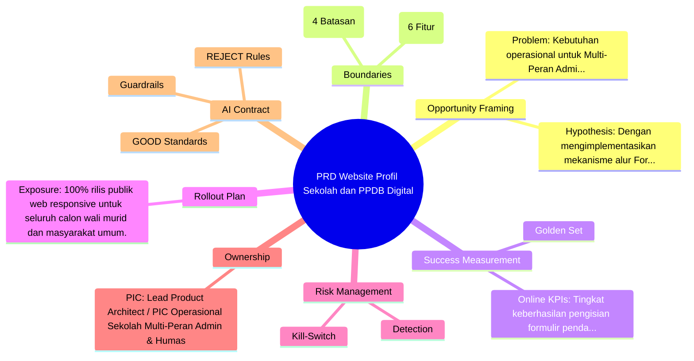
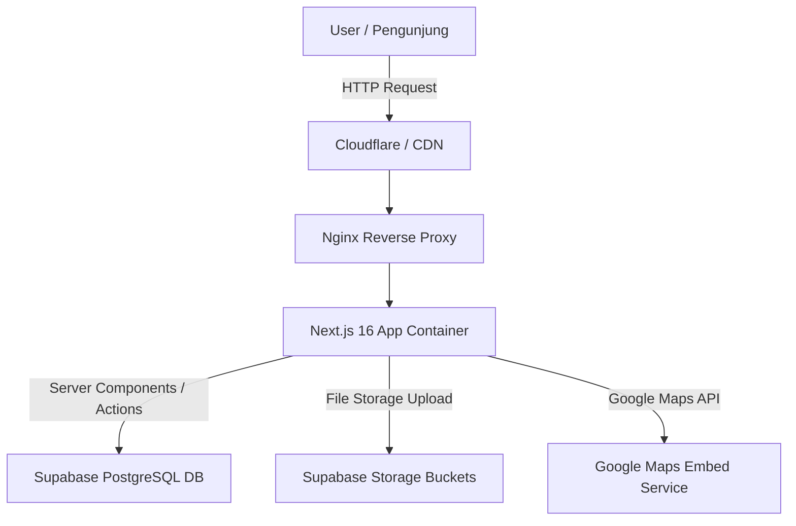
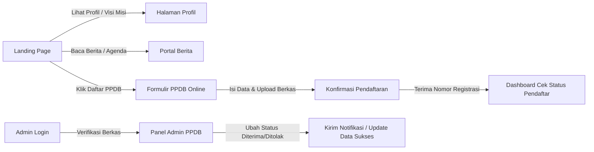
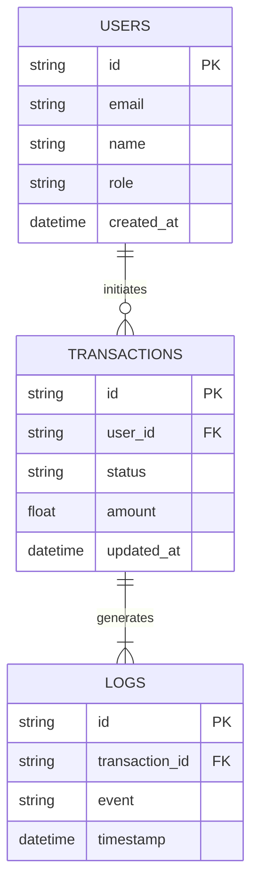
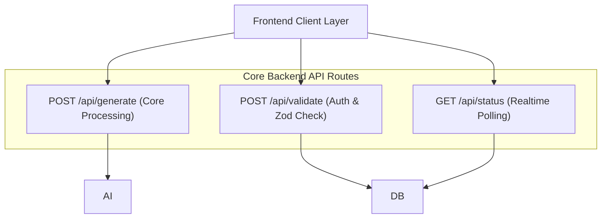
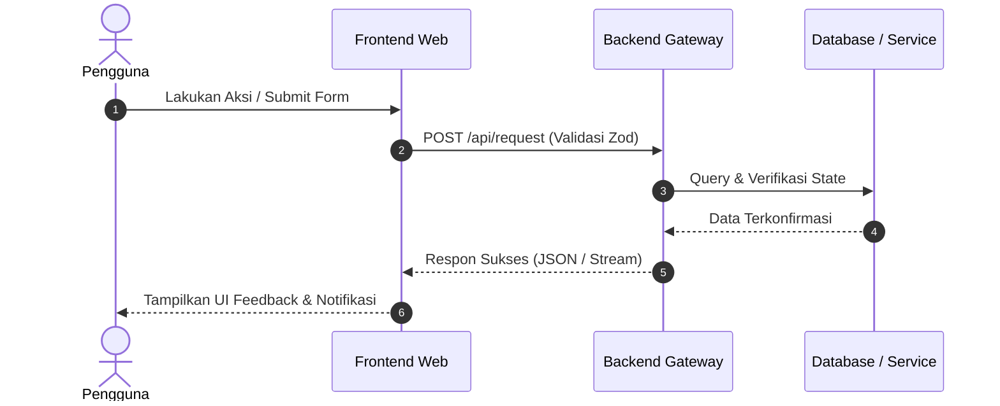

# PRD Website Profil Sekolah dan PPDB Digital
*Product Requirements Document (Modern PRD Framework for AI Prototyping)*
*Arketipe Produk: Institusi / Profil Sekolah / Edukasi | Target Audiens: Calon Peserta Didik Baru, Orang Tua / Wali Murid, Guru, Staff Akademik, dan Masyarakat Umum*

---

## 1. OPPORTUNITY FRAMING
- **Core Problem:** Kebutuhan operasional untuk Multi-Peran (Admin & Humas): Sistem saat ini memerlukan otomatisasi alur digital untuk pembuatan website profil sekolah dan pendaftaran siswa baru guna mencegah inefisiensi, antrean manual, dan kendala operasional penyebaran informasi.
- **Working Hypothesis:** Dengan mengimplementasikan mekanisme alur Formulir & Upload Berkas, proses pendaftaran, seleksi, dan pertukaran informasi sekolah berjalan cepat, akurat, transparan, dan minim friksi bagi calon siswa maupun orang tua.
- **Strategy Fit:** Keunggulan arsitektur & integrasi kunci: Mengandalkan arsitektur modern Next.js 16 App Router, Supabase PostgreSQL, dan Google Maps Embed untuk menjamin keandalan, skalabilitas, dan daya saing institusi pendidikan.

---

## 2. BOUNDARIES & SCOPE
### Deep Feature Architecture (MVP Breakdown)
#### Fitur #1: [P0] Modul Profil, Sambutan & Visi Misi
- **User Story:** Sebagai pengunjung atau calon wali murid, saya ingin melihat profil lengkap, sambutan kepala sekolah, serta visi misi institusi agar saya dapat menilai kredibilitas sekolah.
- **Alur Kerja (Happy Path):**
  1. Pengguna membuka halaman utama website sekolah.
  2. Sistem merender halaman profil menggunakan Server Component untuk kecepatan maksimal.
  3. Pengguna menavigasi ke tab Sambutan Kepala Sekolah dan Visi Misi.
  4. Sistem menampilkan informasi lengkap beserta foto resmi dan struktur organisasi.
- **Aturan Bisnis & Validasi:**
  - Konten profil sekolah hanya dapat diubah oleh pengguna dengan peran Super Admin.
  - Gambar kepala sekolah wajib dioptimasi dalam format WebP dengan ukuran maksimal 500KB.
  - Struktur organisasi harus ditampilkan dalam bentuk hierarki visual yang responsif.
- **Edge Cases & Solusi Gagal:**
  - Jika data profil gagal dimuat dari database, tampilkan fallback UI statis dengan pesan informasi pemeliharaan.
- **Komponen Teknis Terkait:**
  - Frontend: app/(marketing)/profil/page.tsx, components/school/PrincipalWelcome.tsx, components/school/VisionMission.tsx
  - API Endpoints: -
  - Tabel Database: -
- **Prompt Coding Agent (Cursor / Claude Code):**
```text
Buat komponen React Server Component untuk halaman profil sekolah di app/(marketing)/profil/page.tsx yang mengambil data dari tabel schools di Supabase, didukung desain Tailwind CSS yang bersih dan profesional dengan palet Navy Blue.
```

#### Fitur #2: [P0] Formulir Pendaftaran Siswa Baru (PPDB Online & Upload Berkas)
- **User Story:** Sebagai calon siswa atau orang tua, saya ingin mengisi formulir pendaftaran secara online dan mengunggah dokumen persyaratan agar proses pendaftaran lebih praktis tanpa harus datang ke sekolah.
- **Alur Kerja (Happy Path):**
  1. Pengguna mengakses halaman PPDB Online dan mengeklik tombol Daftar Sekarang.
  2. Pengguna mengisi data diri siswa, data orang tua, dan asal sekolah pada multi-step form.
  3. Pengguna mengunggah dokumen scan rapor dan akta kelahiran (format PDF/PNG/JPG).
  4. Sistem memvalidasi input menggunakan Zod, mengunggah berkas ke Supabase Storage, dan menyimpan data registrasi ke tabel ppdb_registrations.
  5. Sistem menampilkan nomor registrasi unik dan status pendaftaran berhasil.
- **Aturan Bisnis & Validasi:**
  - Pendaftaran hanya dapat dilakukan selama periode gelombang PPDB aktif.
  - Ukuran file unggahan dokumen maksimal 5MB per berkas.
  - Nomor registrasi digenerate secara otomatis dengan format unik berbasis tahun dan nomor urut.
- **Edge Cases & Solusi Gagal:**
  - Jika ukuran file melebihi batas 5MB, sistem menolak unggahan di sisi klien dan menampilkan pesan error merah.
  - Jika koneksi terputus saat submit, sediakan tombol retry tanpa menghilangkan data form yang telah diisi.
- **Komponen Teknis Terkait:**
  - Frontend: app/(marketing)/ppdb/page.tsx, components/ppdb/RegistrationForm.tsx
  - API Endpoints: -
  - Tabel Database: -
- **Prompt Coding Agent (Cursor / Claude Code):**
```text
Buat Server Action di app/actions/ppdb.ts untuk menangani pendaftaran siswa baru dengan validasi Zod schema, integrasi upload berkas ke Supabase Storage bucket 'documents', dan penyimpanan ke tabel 'ppdb_registrations'.
```

#### Fitur #3: [P1] Manajemen Berita & Pengumuman Sekolah
- **User Story:** Sebagai humas sekolah, saya ingin mempublikasikan berita kegiatan dan pengumuman penting agar informasi sekolah tersampaikan secara transparan kepada publik.
- **Alur Kerja (Happy Path):**
  1. Admin masuk ke Panel Admin dan memilih menu Kelola Berita.
  2. Admin mengisi judul, kategori, konten artikel, dan unggah gambar utama.
  3. Admin mengeklik tombol Publikasikan.
  4. Sistem menyimpan data ke tabel posts dan langsung memperbarui halaman utama website.
- **Aturan Bisnis & Validasi:**
  - Artikel berita wajib memiliki judul, isi, dan kategori yang valid.
  - Pengumuman penting dapat disematkan (pinned) agar tampil di bagian teratas beranda.
  - Setiap artikel mencatat timestamp pembuatan dan author yang mengunggah.
- **Edge Cases & Solusi Gagal:**
  - Jika admin mengosongkan judul artikel, sistem menampilkan peringatan validasi form secara inline.
- **Komponen Teknis Terkait:**
  - Frontend: app/(admin)/posts/page.tsx, components/admin/PostEditor.tsx
  - API Endpoints: -
  - Tabel Database: -
- **Prompt Coding Agent (Cursor / Claude Code):**
```text
Buat komponen CMS admin untuk manajemen berita di app/(admin)/posts/page.tsx beserta Server Actions untuk operasi CRUD artikel berita terhubung ke database Supabase.
```

#### Fitur #4: [P0] Integrasi Google Maps Embed Lokasi Sekolah
- **User Story:** As a calon wali murid, saya ingin melihat peta lokasi fisik sekolah melalui Google Maps agar saya dapat memperkirakan jarak dan rute menuju lokasi sekolah.
- **Alur Kerja (Happy Path):**
  1. Pengguna membuka halaman Kontak Sekolah.
  2. Sistem merender iframe Google Maps Embed dengan koordinat akurat sekolah.
  3. Pengguna dapat berinteraksi dengan peta untuk melihat petunjuk arah.
- **Aturan Bisnis & Validasi:**
  - URL Embed Google Maps disimpan dalam konfigurasi database sekolah agar mudah diperbarui.
  - Iframe harus bersifat responsif menyesuaikan ukuran layar perangkat pengguna.
- **Edge Cases & Solusi Gagal:**
  - Jika koneksi internet lambat sehingga map gagal dimuat, tampilkan kotak placeholder dengan teks alamat teks lengkap dan tombol buka di Google Maps.
- **Komponen Teknis Terkait:**
  - Frontend: components/shared/SchoolMap.tsx, app/(marketing)/kontak/page.tsx
  - API Endpoints: -
  - Tabel Database: -
- **Prompt Coding Agent (Cursor / Claude Code):**
```text
Buat komponen React reusable untuk Google Maps Embed di components/shared/SchoolMap.tsx dengan styling Tailwind CSS responsif dan penanganan loading fallback.
```

#### Fitur #5: [P0] Panel Verifikasi Berkas PPDB untuk Admin
- **User Story:** As an admin sekolah, saya ingin memverifikasi data dan berkas pendaftar PPDB secara digital agar proses seleksi calon siswa berjalan efektif.
- **Alur Kerja (Happy Path):**
  1. Admin login ke panel admin dan membuka menu Data Pendaftar PPDB.
  2. Admin melihat daftar siswa yang mendaftar beserta status verifikasi.
  3. Admin mengklik detail pendaftar, memeriksa dokumen yang diunggah, dan mengubah status menjadi Diterima atau Ditolak.
  4. Sistem memperbarui status di database dan mencatat log verifikasi.
- **Aturan Bisnis & Validasi:**
  - Hanya pengguna dengan peran Admin atau Super Admin yang dapat mengubah status verifikasi.
  - Setiap perubahan status wajib mencatat ID admin yang melakukan verifikasi.
- **Edge Cases & Solusi Gagal:**
  - Jika berkas dokumen corrupt atau tidak terbaca, admin dapat memberikan catatan revisi pada status pendaftar.
- **Komponen Teknis Terkait:**
  - Frontend: app/(admin)/ppdb/page.tsx, components/admin/VerificationTable.tsx
  - API Endpoints: -
  - Tabel Database: -
- **Prompt Coding Agent (Cursor / Claude Code):**
```text
Buat halaman manajemen verifikasi pendaftar PPDB di app/(admin)/ppdb/page.tsx yang menampilkan tabel data pendaftar dengan filter status dan aksi ubah status via Server Action.
```

### Non-Goals (Explicitly Out of Scope)
- Sistem pembayaran SPP bulanan otomatis via payment gateway berlangganan di fase pertama
- Aplikasi mobile native terpisah untuk Android dan iOS
- Sistem Learning Management System (LMS) penuh untuk kelas online
- Fitur live chat interaktif real-time dengan AI chatbot (ditunda ke fase lanjutan)

---

## 3. SUCCESS MEASUREMENT
- **Offline Golden Set (Validation):** Semua alur utama (happy path pendaftaran PPDB, publikasi berita, dan navigasi profil) lolos validasi fungsional dan pengujian end-to-end tanpa blocking bug pada environment staging.
- **Human Review (Qualitative Audit):** Uji kepuasan operasional oleh staf humas dan admin sekolah menunjukkan kemudahan penggunaan sistem dengan waktu pelatihan operasional kurang dari 30 menit.
- **Online Metrics (KPIs & Thresholds):** Tingkat keberhasilan pengisian formulir pendaftaran > 95%, adopsi modul pengumuman oleh orang tua siswa > 75%, latensi respons API server < 1.5 detik.

---

## 4. ROLLOUT PLAN
- **Exposure:** 100% rilis publik web responsive untuk seluruh calon wali murid dan masyarakat umum.
- **Duration:** Fase evaluasi dan pemantauan stabilitas sistem selama 14 hari pasca peluncuran awal.
- **Segments & Ramp Gates:** Pastikan performa First Contentful Paint (FCP) < 1.2 detik, skor Lighthouse SEO & Performance > 90, dan tidak ada error fatal (5xx) di log server.

---

## 5. RISK MANAGEMENT
- **Detection Mechanism:** Log anomali transaksi dan upload file terpusat, validasi integritas skema database Supabase, dan pemantauan status endpoint API secara realtime.
- **Fallback & Kill Switch:** Kebijakan mitigasi risiko: Static Page Caching via CDN. Sediakan saklar darurat (kill-switch) berupa mode baca-saja (maintenance mode) jika terjadi lonjakan trafik berlebih atau gangguan layanan pihak ketiga.

---

## 6. OWNERSHIP & ACTION
- **Primary Owner (PIC):** Lead Product Architect / PIC Operasional Sekolah (Multi-Peran Admin & Humas)
- **Decision Points & Cadence:** Evaluasi metrik operasional mingguan untuk menentukan prioritas pengembangan fitur lanjutan pada fase 2.

---

## 7. AI-SPECIFIC ADDITIONS
### Behavior Contract
#### [GOOD] Wajib Dilakukan:
- [GOOD] Menghasilkan kode modular, type-safe dengan TypeScript strict mode, dan responsif menggunakan Tailwind CSS.
- [GOOD] Menerapkan Server Components secara default di Next.js 16 dan Server Actions dengan validasi skema Zod.
- [GOOD] Mengamankan seluruh akses tabel Supabase menggunakan Row-Level Security (RLS) yang ketat sesuai peran pengguna.

#### [REJECT] Dilarang Keras:
- [REJECT] Menggunakan 'use client' secara berlebihan pada komponen yang seharusnya dapat dirender sebagai Server Component.
- [REJECT] Menyimpan kredensial database atau secret key API secara hardcode di dalam kode sumber frontend.
- [REJECT] Mengabaikan penanganan error (error boundaries) dan validasi input sisi server saat menerima payload formulir.

### Guardrails
- Validasi input ketat menggunakan Zod pada setiap Server Action dan API Route.
- Sanitasi data string untuk mencegah kerentanan SQL Injection dan Cross-Site Scripting (XSS).
- Gunakan environment variables yang aman dan terenkripsi pada container Docker runtime.
- Batasan ukuran maksimum unggahan berkas dokumen (maks 5MB untuk PDF/JPG/PNG).

---

## 8. ACTIONABLE TASK BREAKDOWN (FOR AI CODING AGENTS)
- [ ] Step 1: [FASE 1 - FRONTEND & APP SHELL LAYOUT]: Bangun kerangka Layout App Shell dengan Collapsible Sidebar kiri (w-64 desktop ke w-16 collapsed, mobile sheet drawer) dan Sticky Topbar navigasi di app/(dashboard)/layout.tsx.
- [ ] Step 2: [FASE 1 - FRONTEND & APP SHELL LAYOUT]: Bangun Marketing Landing Page responsif yang mencakup Hero Section, Feature Grid, Sambutan Kepala Sekolah, Berita Terbaru, Galeri, dan Footer di app/(marketing)/page.tsx.
- [ ] Step 3: [FASE 1 - FRONTEND & APP SHELL LAYOUT]: Bangun kerangka Admin Panel Layout dengan Admin Sidebar, RBAC Guard, dan Header manajemen di app/(admin)/layout.tsx.
- [ ] Step 4: [FASE 1 - FRONTEND & APP SHELL LAYOUT]: Buat komponen UI interaktif untuk Formulir PPDB Online dengan multi-step wizard dan validasi client-side.
- [ ] Step 5: [FASE 2 - BACKEND & DB]: Rancang skema database relasional Supabase PostgreSQL untuk tabel profiles, schools, ppdb_registrations, posts, dan announcements dengan RLS policies.
- [ ] Step 6: [FASE 2 - BACKEND & DB]: Implementasikan Zod validation schema dan Server Actions untuk pemrosesan pendaftaran siswa baru serta penyimpanan berkas ke Supabase Storage.
- [ ] Step 7: [FASE 2 - BACKEND & DB]: Buat API Route Handler untuk manajemen konten berita, pengumuman, dan galeri sekolah oleh admin.
- [ ] Step 8: [FASE 3 - INTEGRASI]: Hubungkan komponen frontend Formulir PPDB ke Server Actions backend dengan penanganan state loading, toast notifications, dan error handling yang elegan.
- [ ] Step 9: [FASE 3 - INTEGRASI]: Integrasikan komponen Google Maps Embed pada halaman kontak sekolah dengan kustomisasi marker dan responsivitas layout.
- [ ] Step 10: [FASE 4 - DEPLOY & TEST]: Lakukan pengujian end-to-end (E2E) alur pendaftaran siswa dan manajemen konten menggunakan Playwright.
- [ ] Step 11: [FASE 4 - DEPLOY & TEST]: Konfigurasikan Dockerfile multi-stage build untuk Next.js 16 dan setup docker-compose untuk environment produksi lokal.
- [ ] Step 12: [FASE 4 - DEPLOY & TEST]: Lakukan deployment container ke server VPS / Coolify, verifikasi environment variables, dan uji performa akhir.

---

## 9. ARCHITECTURE DIAGRAMS & MINDMAP (MERMAID)
### Visual Taxonomy Mindmap


### 1. System Data Flowchart


### 2. User Journey & Sitemap Flow


### 3. Database Schema (ERD)


### 4. API & Webhook Integration Matrix


### 5. Core Sequence Flow

